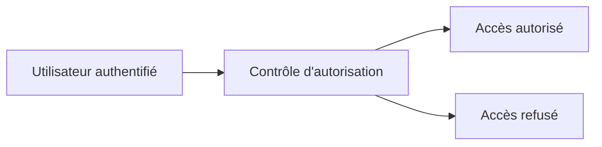

---
## `autorisation.md`
---

# Autorisation

## Objectif de cette section

Cette page présente l’**autorisation** dans le projet **ONY** sous l’angle de la sécurité.

L’objectif est d’expliquer :

- ce qu’est l’autorisation ;
- en quoi elle diffère de l’authentification ;
- pourquoi elle est indispensable pour protéger les ressources ;
- comment elle participe à la maîtrise des accès.

## Définition

L’autorisation consiste à déterminer ce qu’un utilisateur authentifié a réellement le droit de faire.

Autrement dit :

- l’authentification répond à la question **qui est l’utilisateur ?**
- l’autorisation répond à la question **que peut-il faire ?**

Cette distinction est essentielle dans toute application manipulant des données privées, des actions sensibles ou des rôles différents.

## Rôle de sécurité

L’autorisation permet de protéger l’application contre les accès illégitimes à des ressources ou à des actions qui ne devraient pas être accessibles à tous les utilisateurs.

Elle sert notamment à :

- limiter l’accès à certaines pages ;
- filtrer les données selon l’utilisateur ;
- empêcher des actions non autorisées ;
- encadrer les opérations sensibles ;
- renforcer l’isolation logique entre les comptes.

## Pourquoi l’authentification ne suffit pas

Un utilisateur connecté n’a pas nécessairement le droit d’accéder à tout.

Sans autorisation correctement pensée, il existe un risque qu’un utilisateur authentifié puisse :

- consulter des données qui ne lui appartiennent pas ;
- réaliser une action réservée ;
- contourner des limites métier ;
- accéder à des fonctions d’administration ou de gestion.

C’est pour cela que l’autorisation constitue une brique distincte et indispensable.

## Niveaux possibles d’autorisation

L’autorisation peut s’exprimer à plusieurs niveaux.

### Accès à une page ou une zone

Certaines pages ou sections peuvent être réservées selon l’état de connexion ou le profil de l’utilisateur.

### Accès à une ressource

Une donnée ne doit pas seulement exister : elle doit être accessible uniquement par les bons utilisateurs.

### Droit d’action

Certaines actions peuvent être plus sensibles que d’autres, par exemple :

- modifier ;
- supprimer ;
- publier ;
- payer ;
- administrer.

## Contrôle côté interface et côté données

Une bonne autorisation ne doit jamais reposer uniquement sur le frontend.

Le fait de masquer un bouton ou une page ne suffit pas.

Les contrôles doivent être pensés à plusieurs niveaux :

- dans l’interface ;
- dans la logique applicative ;
- dans l’accès réel aux données.

La sécurité doit porter sur l’action réelle, pas uniquement sur l’affichage.

## Risques en cas de mauvaise autorisation

Une autorisation mal conçue peut entraîner :

- fuite de données ;
- accès croisé entre utilisateurs ;
- actions non légitimes ;
- exposition de zones sensibles ;
- perte de confiance dans l’application.

Ces risques peuvent être particulièrement graves dès lors que l’application manipule des comptes, des événements, des paiements ou des informations personnelles.

## Bonnes pratiques

Les bonnes pratiques attendues sont notamment :

- distinguer clairement authentification et autorisation ;
- vérifier les droits sur les ressources sensibles ;
- ne pas se contenter du masquage visuel côté client ;
- raisonner en accès réels et non en apparence d’interface ;
- documenter les règles de contrôle importantes.

## Vue simplifiée

