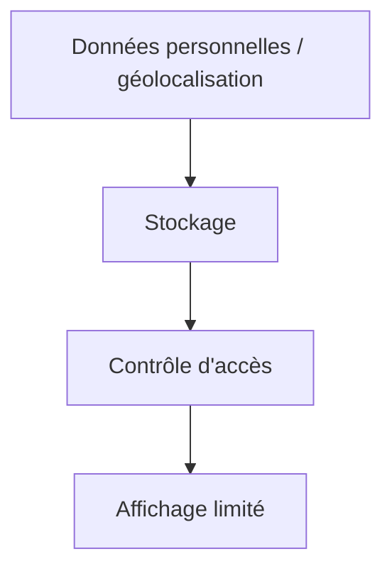

---
## `geolocalisation-et-donnees-perso.md`
---

# Géolocalisation et données personnelles

## Objectif de cette section

Cette page présente les enjeux de sécurité et de protection liés à la **géolocalisation** et aux **données personnelles** dans **ONY**.

L’objectif est d’expliquer :

- pourquoi ces données sont sensibles ;
- quels risques doivent être pris en compte ;
- pourquoi leur collecte doit rester justifiée ;
- quelles précautions doivent encadrer leur traitement.

## Sensibilité des données

Les données personnelles sont, par nature, des données à protéger.

La géolocalisation l’est d’autant plus lorsqu’elle permet :

- d’identifier un lieu fréquenté ;
- de rattacher une personne à un événement ou une position ;
- de reconstituer un contexte de présence ou de déplacement.

Ces informations doivent donc être manipulées avec prudence.

## Principe de minimisation

Une bonne approche de sécurité consiste à ne collecter que ce qui est réellement nécessaire.

Autrement dit :

- ne pas demander une donnée sans raison claire ;
- ne pas conserver plus que nécessaire ;
- ne pas exposer inutilement l’information ;
- ne pas multiplier les usages secondaires mal cadrés.

Cette logique réduit à la fois le risque technique et le risque de mauvaise utilisation.

## Risques principaux

Les principaux risques sont notamment :

- exposition d’informations personnelles ;
- corrélation entre identité et localisation ;
- accès non autorisé à des données privées ;
- conservation excessive ;
- affichage trop large de données qui devraient rester limitées.

## Enjeu de confiance

La protection de ces données est aussi un enjeu de confiance utilisateur.

Une application qui manipule des informations personnelles ou de localisation doit inspirer une impression claire de sérieux, de maîtrise et de retenue dans le traitement des données.

## Contrôle d’accès

Les données personnelles ne doivent pas être accessibles à tout utilisateur simplement parce qu’elles existent dans le système.

Il faut veiller à :

- restreindre les accès ;
- filtrer ce qui est affiché ;
- protéger les données selon le contexte ;
- éviter les expositions croisées entre comptes.

## Affichage et exposition

Une donnée personnelle ou de géolocalisation peut être techniquement stockée sans devoir être largement affichée.

La sécurité ne porte donc pas seulement sur le stockage, mais aussi sur :

- l’affichage ;
- le partage ;
- l’export éventuel ;
- la consultation via les interfaces.

## Bonnes pratiques

Les bonnes pratiques attendues sont les suivantes :

- collecter uniquement ce qui est utile ;
- limiter la diffusion des données ;
- protéger leur accès ;
- éviter les usages implicites non documentés ;
- conserver une logique claire entre besoin métier et niveau d’exposition.

## Vue simplifiée

