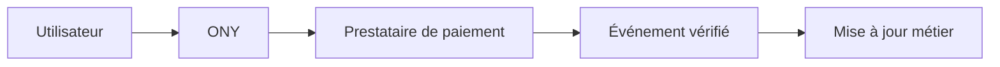

---
## `paiement.md`
---

# Sécurité du paiement

## Objectif de cette section

Cette page présente les principaux enjeux de sécurité liés au **paiement** dans **ONY**.

L’objectif est d’expliquer :

- pourquoi le paiement constitue une zone sensible ;
- quels risques doivent être pris en compte ;
- pourquoi l’intégration doit rester encadrée ;
- comment ce sujet s’articule avec les services tiers et la protection des données.

## Sensibilité du sujet

Le paiement est une fonctionnalité particulièrement sensible, car il touche à la fois :

- l’argent ;
- la confiance utilisateur ;
- les données personnelles ;
- les interactions avec un prestataire externe.

Une erreur dans cette zone peut avoir des conséquences importantes, techniques comme fonctionnelles.

## Rôle du prestataire externe

Dans ONY, la logique de paiement repose sur un service tiers spécialisé.

Cette approche permet de déléguer une partie importante de la sécurité à une plateforme conçue pour cela, tout en limitant ce que l’application gère directement.

C’est une bonne pratique de ne pas réimplémenter soi-même des mécanismes sensibles qui doivent rester maîtrisés par un prestataire reconnu.

## Points de vigilance

Même avec un prestataire externe, plusieurs points restent critiques côté projet.

### Protection des clés

Les clés et secrets liés au paiement doivent être protégés avec un niveau d’exigence élevé.

### Validation des événements

Les événements remontés par le prestataire doivent être traités avec prudence, notamment lorsqu’ils impactent l’état métier d’une commande, d’un billet ou d’un paiement.

### Cohérence des statuts

L’application ne doit pas considérer un paiement comme valide sur la seule base d’un affichage côté client.

La validation doit reposer sur une source fiable et vérifiée.

### Distinction entre test et production

Les environnements de test et de production doivent rester clairement séparés pour éviter les erreurs de configuration ou de manipulation.

## Risques principaux

Les principaux risques à couvrir sont :

- usurpation ou détournement de flux ;
- mauvaise validation d’un paiement ;
- fuite de secret lié au prestataire ;
- confusion entre environnement de test et environnement réel ;
- incohérence entre état de paiement et état métier de l’application.

## Ce que l’application doit éviter

L’application doit éviter de :

- stocker inutilement des données sensibles ;
- faire confiance à une information critique non vérifiée ;
- exposer des secrets dans le frontend ;
- mélanger les rôles entre logique métier et sécurité de paiement.

## Bonnes pratiques

Les bonnes pratiques attendues sont les suivantes :

- laisser au prestataire spécialisé la gestion des éléments les plus sensibles ;
- limiter la surface manipulée par l’application ;
- protéger strictement les secrets liés au paiement ;
- vérifier les événements et statuts critiques ;
- séparer clairement les environnements.

## Vue simplifiée

