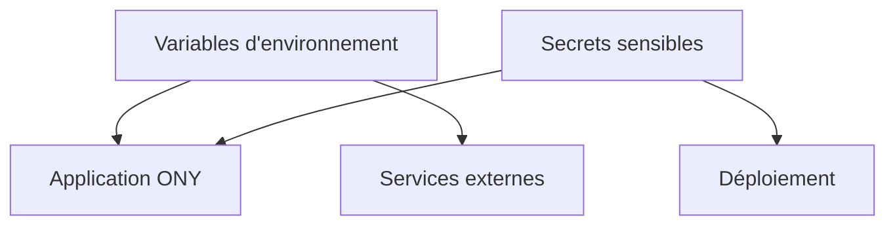

---
## `secrets-et-env.md`

---

# Secrets et variables d’environnement

## Objectif de cette section

Cette page présente les enjeux de sécurité liés aux **secrets** et aux **variables d’environnement** dans **ONY**.

L’objectif est d’expliquer :

- pourquoi ces éléments sont sensibles ;
- quels risques existent en cas de mauvaise gestion ;
- pourquoi ils ne doivent pas apparaître dans le code source ou la documentation publique ;
- quelles bonnes pratiques doivent être respectées.

## Définition

Les secrets et variables d’environnement servent à configurer l’application et son écosystème technique.

Ils peuvent contenir :

- des clés d’API ;
- des secrets applicatifs ;
- des identifiants techniques ;
- des paramètres d’environnement ;
- des informations nécessaires au déploiement.

Tous ces éléments n’ont pas le même niveau de sensibilité, mais certains sont critiques pour la sécurité du projet.

## Enjeu de sécurité

Le principal enjeu est simple : un secret exposé peut compromettre une partie du système.

Une mauvaise gestion peut permettre :

- un accès non autorisé à un service tiers ;
- l’usurpation d’un composant applicatif ;
- une modification de configuration ;
- une fuite d’information sensible ;
- un impact direct sur la production ou les données.

## Pourquoi les secrets ne doivent pas être versionnés

Les secrets ne doivent pas être inscrits en dur dans le code ni versionnés dans un dépôt Git.

Même si un dépôt paraît privé, ce type de pratique augmente fortement le risque de fuite à moyen terme.

Un secret versionné peut :

- être copié ;
- être oublié dans l’historique ;
- être partagé involontairement ;
- rester visible bien après sa suppression apparente.

## Différence entre variable publique et secret privé

Toutes les variables d’environnement ne sont pas équivalentes.

Il faut distinguer :

- les variables publiques, qui peuvent être exposées côté client si le framework le permet ;
- les variables privées, réservées au backend ou à l’environnement d’exécution ;
- les secrets critiques, qui ne doivent jamais être divulgués.

Cette distinction est particulièrement importante dans les applications web modernes.

## Risques classiques

Les erreurs les plus fréquentes sont par exemple :

- secret commité dans le dépôt ;
- secret affiché dans un log ;
- confusion entre variable publique et privée ;
- duplication mal maîtrisée entre environnements ;
- documentation trop précise sur les valeurs réelles.

## Bonnes pratiques

Les bonnes pratiques attendues sont les suivantes :

- séparer configuration et code ;
- ne jamais exposer les vraies valeurs dans la documentation ;
- maintenir des jeux de variables distincts selon l’environnement ;
- limiter l’accès aux secrets au strict nécessaire ;
- renouveler les secrets compromis ou suspects ;
- clarifier le rôle des variables sans publier leur contenu réel.

## Lien avec le déploiement

Les secrets et variables d’environnement jouent aussi un rôle important dans le déploiement.

Ils permettent :

- d’adapter l’application selon l’environnement ;
- d’injecter la bonne configuration ;
- d’activer les intégrations externes ;
- de garder un même code pour plusieurs contextes d’exécution.

Mais cette souplesse ne doit jamais se faire au détriment de la sécurité.

## Vue simplifiée

